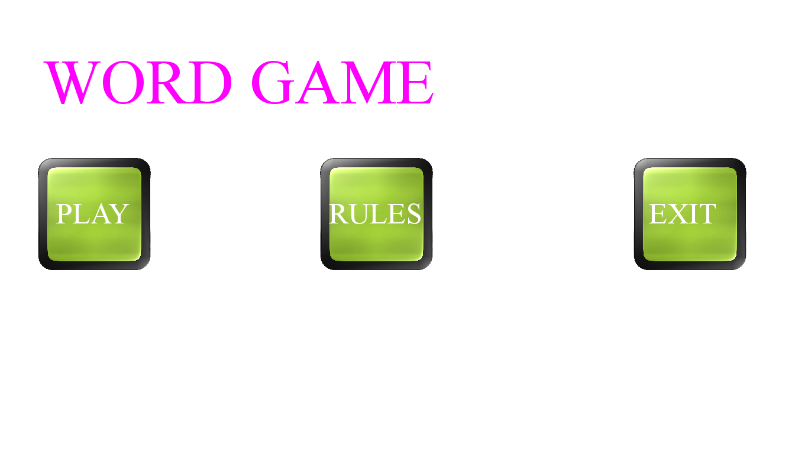
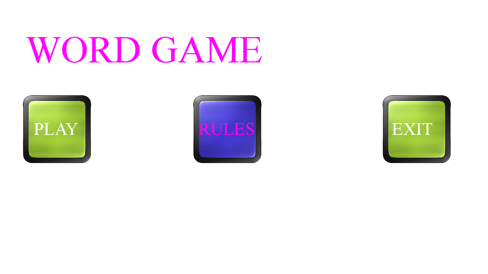
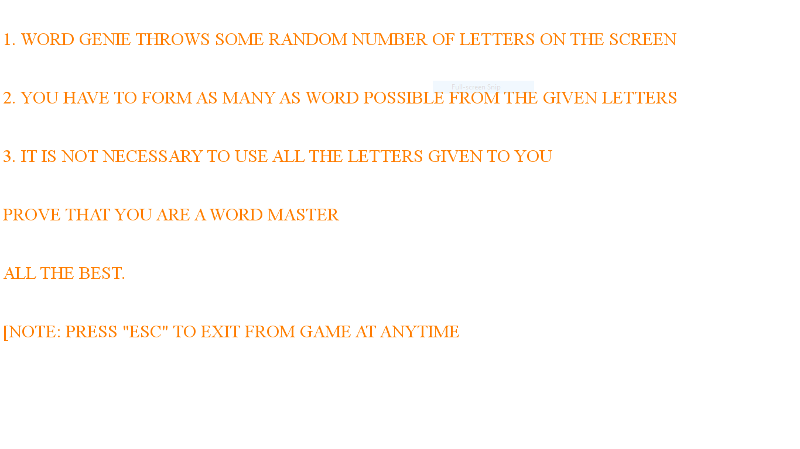
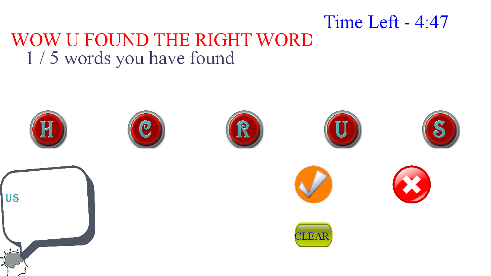
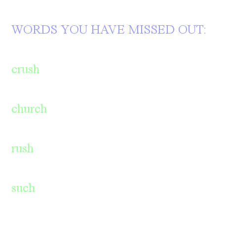

**Word Game**

**Concept of the Word Game**

Many word games are there already but still the concept I have used for
my game is different from them. Most of the other word games, they give
a set of letter to the gamer and he/she has to find only one word out of
it. But in my case I give a set of letters to the Gamer and he/she has
to find all the possible word and those word may vary in length and also
the letters can repeat one or more times.

**Detailed description of each module**

1. GAME MODULE – Overall game module. This module is the one which is
started first when you run the Game and it initializes the Pygame
libraries and its functions. Then it also has some useful functions for
messaging and also displays the rules page when user presses the rules
button.

2. WORD GAME MODULE – This module is invoked by GAME module when play or
rules button is pressed. In this module, the words which are going to be
used in the game are selected randomly from the large set of words. This
module also has the functions for updating timer, checking whether user
found a word or not and displaying respective message for an event i.e.
whether user found it or he missed it.

**Snapshots taken:**

Rules page:

References

http://www.pygame.org/docs/

<https://pythonprogramming.net/pygame-python-3-part-1-intro/>

<https://docs.python.org/>
